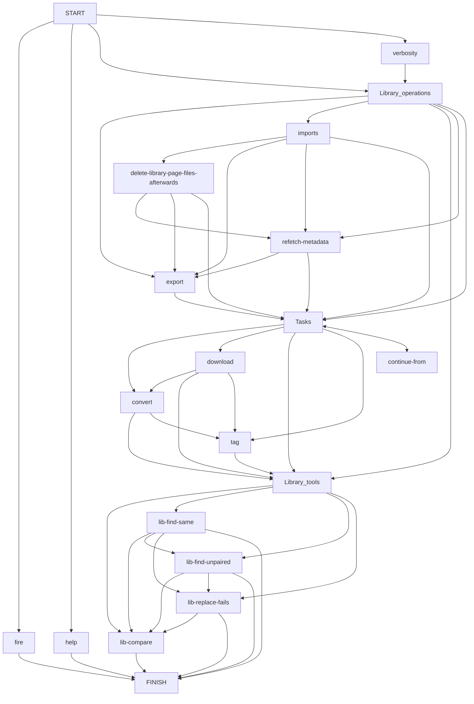

# YTMASC

<a href="#"></a>

YTMASC(**Y**ou**T**ube **M**usic **A**udio **S**craper & syn**C**hronizer) is a multi-tool based on `yt-dlp` that allows you to create fast&reproducible offline music libraries.

Grab the latest alpha version [here](https://github.com/Egezenn/YTMASC/releases)!

It's features are:

- Downloading, converting and tagging
- CLI (shipped as a binary for Windows!)
- Import a CSV of your own (columns are: *`watch_id`, `artist`, `title`)
- Importing favorites from [Metrolist](https://github.com/mostafaalagamy/Metrolist), [Kreate](https://github.com/knighthat/Kreate) databases
- Maintaining a data file for your music for an easily reproducible collection
- Scraping your [library page from YouTube Music](https://music.youtube.com/playlist?list=LM)
- Some helper functions to modify your data file easier and for easy migration

> [!IMPORTANT]
> You need `ffmpeg` binaries for conversion.

## CLI Usage Examples

> Show the help:
>
> ```shell
> ytmasc` | `ytmasc -h
> ```

> Run a singular file operation using the fire interface:
>
> ```shell
> ytmasc --fire download | convert | tag <watch_id>
> ```

> Import (Changes in file tags, CSV, Kreate database export):
>
> ```shell
> ytmasc --import-from files | path/to/your.csv | path/to/your.db --import-level soft
> ```

> Import library page
>
> ```shell
> ytmasc --import-library-page fetch-soft | fetch-soft-no-overwrite | no-fetch-softno-fetch-soft-no-overwrite
> ```

> Export the library as CSV to the path you specify
>
> ```shell
> ytmasc --export-to path-of-your-choosing
> ```

> [!TIP]
> You can chain all these commands in a meaningful manner, see the [flowchart](#flowchart-of-operations).
>
> ```shell
> ytmasc --import-library-page fetch-soft --delete-library-page-files-afterwards --refetch-metadata --import-from song.db --import-from data/x.csv --download --convert opus --tag --lib-find-same
> ```

## Side notes

> [!NOTE]
> YouTube blocks API requests if you exceed the amount they classify you as a bot (around 200 requests). You can either use a VPN, proxy or just wait to bypass this. See related `yt-dlp` [issue](https://github.com/yt-dlp/yt-dlp/issues/10128). Currently the download loop breaks and skips to the next task.

> [!TIP]
> While downloading, some changes may occur in YouTube which results in an error.
You can use `ytmasc --db-replace-fails` to replace these `watch_id`s to something else.

### `fetcher.py`

This part is a little duct taped, I couldn't find a good way to get the `libraryPage` formerly known as `likesPage` so I just emulated user input. It's written for a Windows computer that has `firefox` as the default browser and `file explorer`. Shouldn't be hard to tinker and get it to work for your configuration. You can do this manually too, shouldn't take much of your time.

Change `resendAmount` based on your internet connection, page length. Rule of thumb is to divide your like amount by 10 for this.

Change `openingDelay` based on your internet connection.

Change `savePageAsIndexOnRightClick` to which index your save as is on your browser.

The rest is fine if you don't have a really old computer.

<div align="center">

## Special thanks to

- the artists whom pushed me to preserve what I like when services fumbled to do so
- the devs of the many dependencies!

</div>

## Requirements to run from source or build

- `~=python3.13`
- `ffmpeg`
- `uv`

## Flowchart of operations



## Dependencies

### Binaries

[Python ~=3.11](https://www.python.org/) - Core language. Licensed under PSFL license.

[FFmpeg](https://ffmpeg.org/) - Required for the conversion of files. Licensed under LGPLv2.1 license.

### Python packages

| Package                                                          | Usage                                                                                        | License      |
| ---------------------------------------------------------------- | -------------------------------------------------------------------------------------------- | ------------ |
| [beautifulsoup4](https://www.crummy.com/software/BeautifulSoup/) | Parsing user's [library page from YouTube Music](https://music.youtube.com/playlist?list=LM) | MIT          |
| [click](https://github.com/pallets/click)                        | CLI interface                                                                                | BSD-3-Clause |
| [fire](https://github.com/google/python-fire)                    | Exposing some base functions for a basic CLI                                                 | Apache-2.0   |
| [keyboard](https://github.com/boppreh/keyboard)                  | Keypress handling                                                                            | MIT          |
| [mutagen](https://github.com/quodlibet/mutagen)                  | Tagging files                                                                                | GPL-2.0      |
| [pillow](https://github.com/python-pillow/Pillow)                | Manipulation of cover images                                                                 | MIT-CMU      |
| [prettytable](https://github.com/prettytable/prettytable)        | Pretty tables for utilities                                                                  | Custom       |
| [pyautogui](https://github.com/asweigart/pyautogui)              | Input emulation                                                                              | BSD-3-Clause |
| [pyinstaller](https://github.com/pyinstaller/pyinstaller)        | Compilation                                                                                  | GPLv2        |
| [yt-dlp](https://github.com/yt-dlp/yt-dlp)                       | Downloading files off of YouTube                                                             | Unlicense    |
| [ytmusicapi](https://github.com/sigma67/ytmusicapi)              | Metadata fetching                                                                            | MIT          |

## Disclaimer

This project is not in any way, shape or form affiliated with YouTube, Google or any of their subsidiaries and affiliates.
