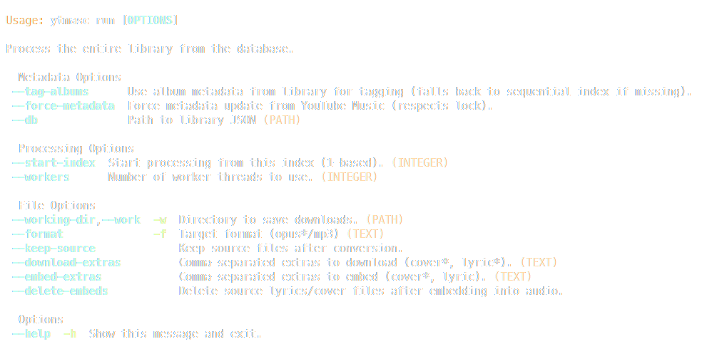
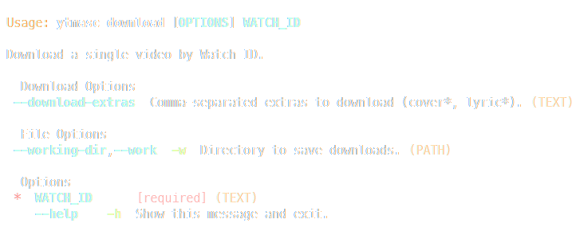
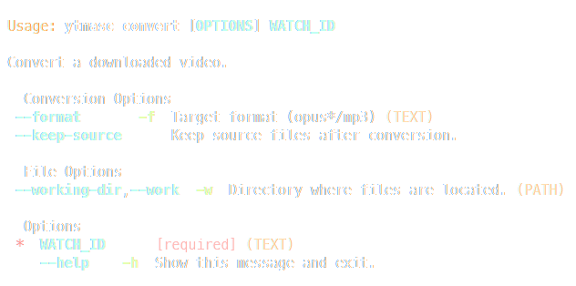
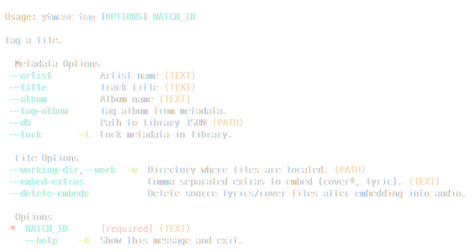

# YTMASC

YTMASC(**Y**ou**T**ube **M**usic **A**udio **S**craper & syn**C**hronizer) is a wrapper around tools such as `yt-dlp` and `ffmpeg` that allows you to create fast&reproducible offline music libraries. Features are:

- Downloading, converting and tagging (in parallel!)
- Maintaining a data file for your music for an easily reproducible collection
- Lyric downloads
- Metadata fetching from YouTube
- More to be restored & implemented!

> [!IMPORTANT]
> You need `yt-dlp`, `ffmpeg` and `magick` binaries on your path.

## CLI TLDR

|                              Description | Command                                                                                                                   |
| ---------------------------------------: | :------------------------------------------------------------------------------------------------------------------------ |
|                            Show the help | `ytmasc`                                                                                                                  |
|                                          | `ytmasc -h`                                                                                                               |
|                                          | `ytmasc --help`                                                                                                           |
|               Process the entire library | `ytmasc run`                                                                                                              |
|                                          | `ytmasc run -w ./data/downloads/ --db ./data/library.json -f opus --download-extras "cover,lyric" --embed-extras "cover"` |
| Process the entire library (in parallel) | `ytmasc run --workers 5`                                                                                                  |
|                  Download a single track | `ytmasc download <id>`                                                                                                    |
|                                          | `ytmasc download <id> -w ./data/downloads/ --download-extras "cover,lyric"`                                               |
|                   Convert a single track | `ytmasc convert <id>`                                                                                                     |
|                                          | `ytmasc convert <id> -w ./data/downloads/ -f opus`                                                                        |
|                       Tag a single track | `ytmasc tag <id>`                                                                                                         |
|                                          | `ytmasc tag <id> -w ./data/downloads/ --db ./data/library.json --embed-extras "cover"`                                    |

|                                |                                  |
| ------------------------------ | -------------------------------- |
|          |  |
|  |            |

## Special thanks to

- the artists whom pushed me to preserve what I like when services fumbled to do so
- the devs of the many dependencies!

## Dependencies

### Binaries

| Package                                    | Usage                                      | License   |
| ------------------------------------------ | ------------------------------------------ | --------- |
| [Python ~=3.12](https://www.python.org)    | Core language                              | PSFL      |
| [yt-dlp](https://github.com/yt-dlp/yt-dlp) | Downloading files off of YouTube           | Unlicense |
| [FFmpeg](https://ffmpeg.org)               | Required for the conversion of audio files | LGPLv2.1  |
| [ImageMagick](https://imagemagick.org)     | Required for the conversion of image files | Custom    |

### Python packages

| Package                                                   | Usage                    | License      |
| --------------------------------------------------------- | ------------------------ | ------------ |
| [click](https://github.com/pallets/click)                 | CLI interface            | BSD-3-Clause |
| [mutagen](https://github.com/quodlibet/mutagen)           | Tagging audio files      | GPL-2.0      |
| [pyinstaller](https://github.com/pyinstaller/pyinstaller) | Compilation              | GPLv2        |
| [requests](https://github.com/psf/requests)               | Making requests          | Apache-2.0   |
| [rich_click](https://github.com/ewels/rich-click)         | Prettified CLI interface | MIT          |
| [ytmusicapi](https://github.com/sigma67/ytmusicapi)       | Metadata fetching        | MIT          |

## Disclaimer

This project is not in any way, shape or form affiliated with YouTube, Google or any of their subsidiaries and affiliates.
