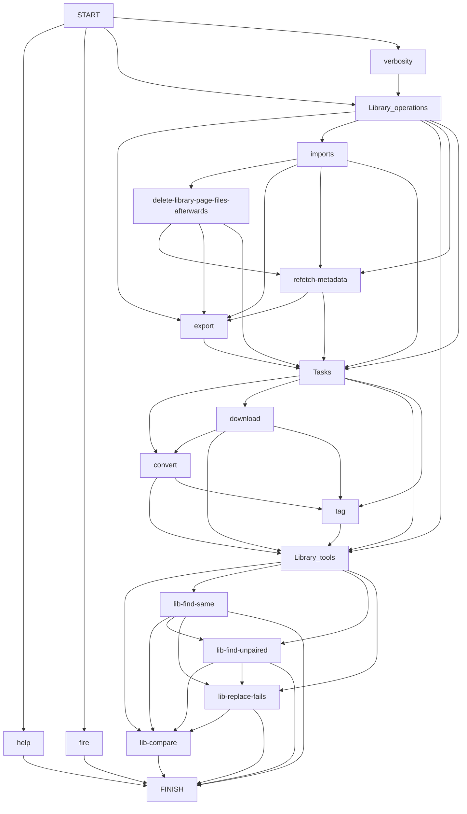

# YTMASC

YTMASC(**Y**ou**T**ube **M**usic **A**udio **S**craper & syn**C**hronizer) in a nutshell, aims to get your music library off of YouTube and provide you an offline backup of it along with other maintenance niceties.

Grab the latest alpha version [here](https://github.com/Egezenn/YTMASC/releases)!

It's features are:

- Automatic downloading, converting and tagging
- CLI (shipped as a binary for Windows!)
- Import a CSV of your own (columns are: *`watch_id`, `artist`, `title`)
- Importing favorites from a [RiMusic](https://github.com/fast4x/RiMusic) database
- Maintaining a data file for your music for an easily reproducible collection
- Scraping your library page from YouTube
- Some helper functions to modify your data file easier and for easy migration

The project just keeps expanding as I learn more stuff and want to implement niche things. So it's currently in alpha stages, you may see new features come and go every now and then.

## CLI Usage Examples

> Show the help:
>
> `ytmasc` | `ytmasc -h`

> Run a singular file operation using the fire interface:
>
> `ytmasc --fire download | convert | tag <watch_id>`

> Import (Changes in file tags, CSV, RiMusic database export):
>
> `ytmasc --import-from files | path/to/your.csv | path/to/your.db --import-level soft`

> Import library page
>
> `ytmasc --import-library-page fetch-soft | fetch-soft-no-overwrite | no-fetch-softno-fetch-soft-no-overwrite`

> Export the library as CSV to the path you specify
>
> `ytmasc --export-to path-of-your-choosing`

> [!TIP]
> You can chain all these commands in a meaningful manner, see the [flowchart](#flowchart-of-the-cli).
>
> `ytmasc --import-library-page fetch-soft --delete-library-page-files-afterwards --refetch-metadata --import-from rimusic_xxxxxxxxxxxxxx.db --import-from data/x.csv --download --convert --tag --lib-find-same`

## Side notes

- You need `ffmpeg` binaries for conversion.
- YouTube blocks API requests if you exceed the amount they classify you as a bot (around 200 requests). You can either use a VPN, proxy or just wait to bypass this. See related `yt-dlp` [issue](https://github.com/yt-dlp/yt-dlp/issues/10128). Currently the download loop breaks and skips to the next task.
- While downloading, some changes may occur in YouTube which results in an error.
You can use `ytmasc --db-replace-fails` to replace these `watch_id`s to something else.

### `fetcher.py`

This part is a little duct taped, I couldn't find a good way to get the `libraryPage` formerly known as `likesPage` so I just emulated user input. It's written for a Windows computer that has `firefox` or `zen` as the default browser and `file explorer`. Shouldn't be hard to tinker and get it to work for your configuration. You can do this manually too, shouldn't take much of your time.

Change `resendAmount` based on your internet connection, page length. Rule of thumb is to divide your like amount by 10 for this.

Change `openingDelay` based on your internet connection.

Change `savePageAsIndexOnRightClick` to which index your save as is on your browser.

The rest is fine if you don't have a really old computer.

## Requirements to run from source or build

- `~=python3.11`
- `python3-tk` (Linux)
- `ffmpeg`

## Flowchart of the CLI

In the monstrosity of a flowchart below, you can find the chaining logic for all the arguments. This is in an effort for the user to run seperate commands and do the whole shebang in one fell swoop. Strange results may occur, it's completely up to the user's usage.

## Dependencies

### Binaries

[Python ~=3.11](https://www.python.org/) - Core language. Licensed under PSFL license.

[FFmpeg](https://ffmpeg.org/) - Required for the conversion of files. Licensed under LGPLv2.1 license.

### Python packages

[beautifulsoup4](https://www.crummy.com/software/BeautifulSoup/) - Used in parsing the user's likes page HTML. Licensed under MIT license.

[click](https://github.com/pallets/click) - Used in CLI, Licensed under BSD-3-Clause license.

[eyed3](https://github.com/nicfit/eyeD3) - Used in tagging the files. Licensed under GPL-3.0 license.

[fire](https://github.com/google/python-fire) - Used in exposing some base functions for a basic CLI. Licensed under Apache-2.0 license.

[ffmpeg-python](https://github.com/kkroening/ffmpeg-python) - Used in converting files to desired format(s) as a wrapper. Licensed under Apache-2.0 license.

[mutagen](https://github.com/quodlibet/mutagen)* - Subdependency, planned to replace eyed3. Licensed under GPL-2.0 license.

[pandas](https://github.com/pandas-dev/pandas) - Used in CSV/JSON helper utilities. Licensed under BSD-3-Clause license.

[pillow](https://github.com/python-pillow/Pillow) - Used in modification of covers. Licensed under MIT-CMU license.

[pyautogui](https://github.com/asweigart/pyautogui) - Used in fetcher to get the user's likes page. Licensed under BSD-3-Clause license.

[pyinstaller](https://github.com/pyinstaller/pyinstaller) - Used in compilation. Licensed under a GPLv2 license.

[yt-dlp](https://github.com/yt-dlp/yt-dlp) - Used in downloading user's library. Licensed under Unlicense license.

[ytmusicapi](https://github.com/sigma67/ytmusicapi) - Used in metadata fetching. Licensed under MIT license.

[fuzzywuzzy](https://github.com/seatgeek/fuzzywuzzy) - Used in comparison utilities for migration for fuzzy matching. Licensed under GPLv2 license.

[python-levenshtein](https://github.com/rapidfuzz/python-Levenshtein)* - Subdependency for fuzzywuzzy. Licensed under GPL-2.0 license.

[keyboard](https://github.com/boppreh/keyboard) - Used in comparison utilities for migration to handle keypresses. Licensed under MIT license.

[prettytable](https://github.com/prettytable/prettytable) - Used in comparison utilities as a part of UX. Licensed under a custom license.

## Disclaimer

This project is not in any way, shape or form affiliated with YouTube, Google or any of their subsidiaries and affiliates.
